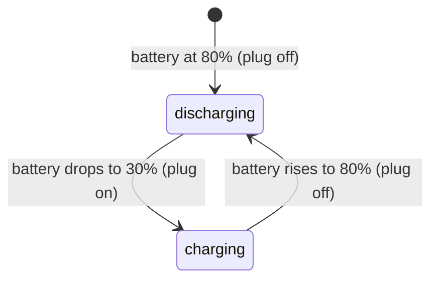

# 🔌 Headless iOS Server Hardware Guide

Repurposing an always-on iPhone as a background server can lead to lithium-ion battery degradation and swelling if left continuously connected to a charger. To prevent this, automate a **Smart Plug** to keep the battery level in the optimal **30% to 80%** range.

---

## 🔋 Battery Longevity Cycle



---

## 🛠️ Setup Options

Choose one of the following methods depending on your home ecosystem:

### Option A: iOS Shortcuts Automation
Let the phone control its own charging state using a HomeKit or app-enabled smart plug.

1. **Turn Charger Off (Upper Limit):**
   * Create a **Personal Automation** triggered by **Battery Level**.
   * Set the slider to **80%**, select **Rises Above 80%**, and select **Run Immediately**.
   * Add your smart plug control action and set it to **Turn OFF**.

2. **Turn Charger On (Lower Limit):**
   * Create a companion **Personal Automation** triggered by **Battery Level**.
   * Set the slider to **30%**, select **Falls Below 30%**, and select **Run Immediately**.
   * Add your smart plug control action and set it to **Turn ON**.

### Option B: Home Assistant Integration
Expose the phone's battery level to Home Assistant (via the Companion App) and use a YAML automation to toggle the smart plug.

```yaml
alias: "Server Phone: Battery Power Management"
trigger:
  - platform: numeric_state
    entity_id: sensor.server_iphone_battery_level
    above: 80
    id: turn_off
  - platform: numeric_state
    entity_id: sensor.server_iphone_battery_level
    below: 30
    id: turn_on
action:
  - service: switch.turn_{{ trigger.id.split('_')[1] }}
    target:
      entity_id: switch.server_phone_smart_plug
```

---

## 🌡️ Environmental Guidelines

> [!WARNING]
> High temperatures degrade batteries rapidly. Maintain optimal operating conditions:

* **Remove cases:** Heavy protective cases trap heat. Strip the phone bare to maximize passive heat dissipation.
* **Minimize display usage:** Turn the physical screen brightness to minimum and enable **Dark Mode** system-wide.
* **Ventilation:** Avoid placing the device in closed cabinets or in direct sunlight.