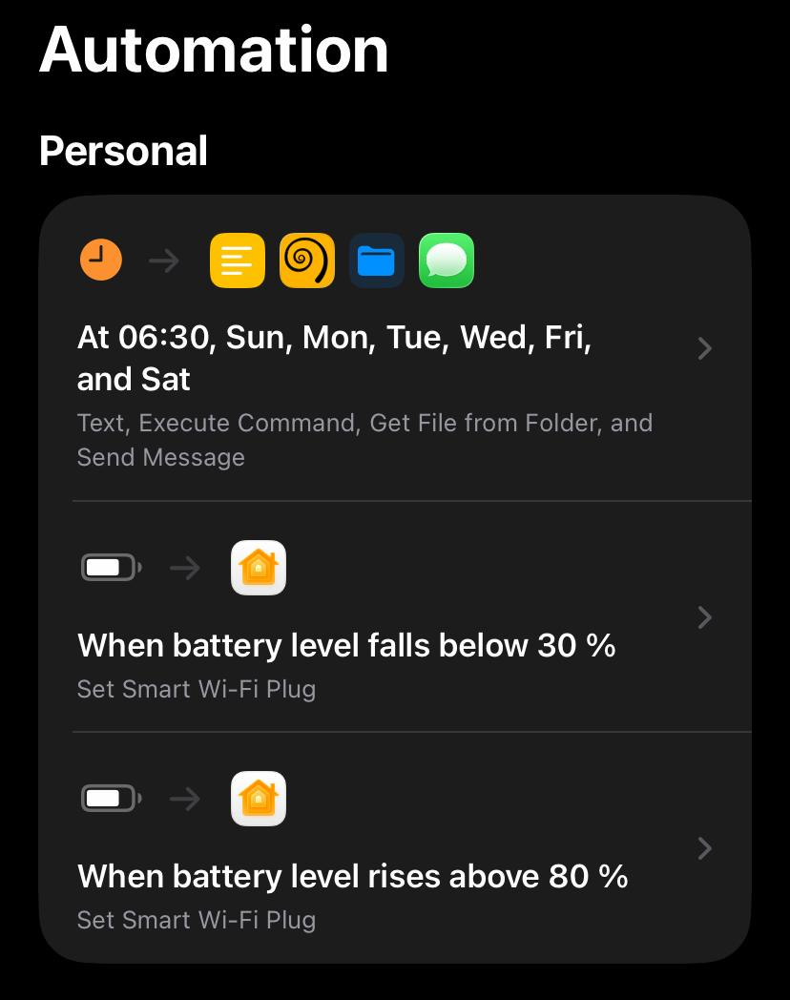
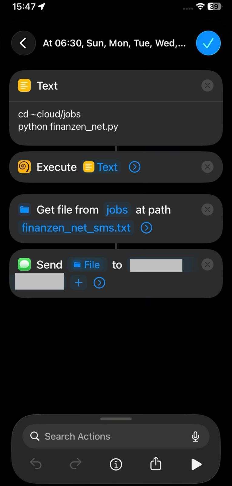

# 📱 iOS Shortcuts Integration Guide

This guide details how to configure a silent, background execution workflow on iOS that runs your Python script and delivers the clean report text via iMessage/SMS.

---

## ⏰ Automation Trigger Setup

Create a new **Personal Automation** set to run weekly (e.g., **Wednesdays at 05:00 AM**). Select **Run Immediately** and disable notifications.



---

## 🧱 The 4-Block Shortcut Actions

Build your shortcut by chaining these four actions:

### 1. 📄 Text
Presents the commands to execute:
```text
cd ~cloud/jobs
python finanzen_net.py
```
*(Using a Text block prevents command syntax breaks in Shortcuts)*

### 2. 🐚 Execute Command (a-Shell)
Runs the terminal commands in the background.
* **Input:** Select the `Text` variable from step 1.
* **Options:**
  * **Open the app...:** Set to `no` (runs silently as a background extension)
  * **Keep going after error:** `OFF`
  * **Show When Run:** `OFF`

### 3. 📁 Get File (Shortcuts)
Reads the cached output directly, bypassing terminal execution logs.
* **Folder:** Select the root `a-Shell` iCloud folder.
* **File Path:** `outputs/finanzen_net_sms.txt`

> [!NOTE]
> The `outputs/` directory is automatically created by the script on its first run. You do not need to create it manually.

### 4. 💬 Send Message (Shortcuts)
Delivers the cached text to your target recipients.
* **Message:** Select the `File` output from step 3.
* **Show Compose Sheet:** `OFF` (enables silent background delivery)

---

## 📋 Visual Pipeline & Settings Summary



| Block | Action | Option / Parameter | Value |
| :--- | :--- | :--- | :--- |
| **1** | **Text** | Text Content | `cd ~cloud/jobs` ↵ `python finanzen_net.py` |
| **2** | **Execute Command** | Open App? | `no` |
| **2** | **Execute Command** | Show When Run | `OFF` |
| **3** | **Get File** | File Path | `outputs/finanzen_net_sms.txt` |
| **4** | **Send Message** | Show Compose Sheet | `OFF` |