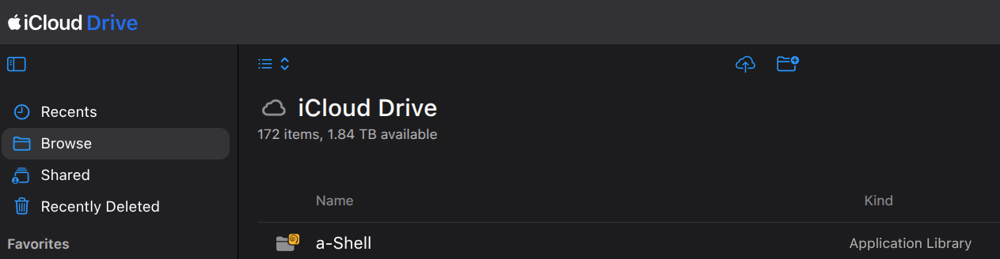

# 📱 iOS Environment Setup Guide

To run Python scripts in the background on your iOS device, you need to set up a terminal emulator and configure iCloud Drive access. This guide walks you through installing **a-Shell** and preparing the folder structure.

---

## ⏰ Step 1: Install a-Shell on iOS

**a-Shell** is a free, open-source terminal emulator for iOS that includes a full, sandboxed Python runtime.

1. Open the **App Store** on your iOS device.
2. Search for **a-Shell** (or **a-Shell Mini** for a smaller footprint).
3. Download and install the app.

---

## ☁️ Step 2: Understand the iCloud Directory Structure

When you install a-Shell, iOS automatically creates a dedicated folder for it inside your iCloud Drive. This allows you to manage files on your computer and have them immediately sync to your iOS device.

### Local iCloud Paths:
* **On macOS:** `/Users/username/Library/Mobile Documents/iCloud~AsheKube~a-Shell/Documents/`
* **On iOS (Files App):** `iCloud Drive ──> a-Shell`

> [!IMPORTANT]
> The scripts must be placed inside the `a-Shell` iCloud folder (typically in a `jobs/` subfolder) so that the terminal emulator can access and run them.

---

## 🔄 Step 3: Next Steps

Once your environment is ready:
Sync your script folder using **rclone** or manual copy (see the [Main README](../README.md)).

